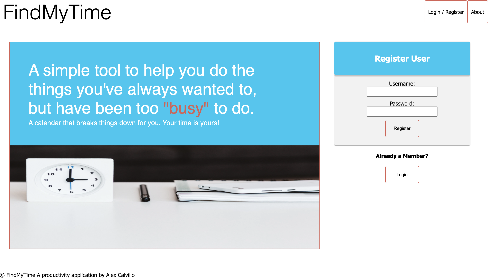
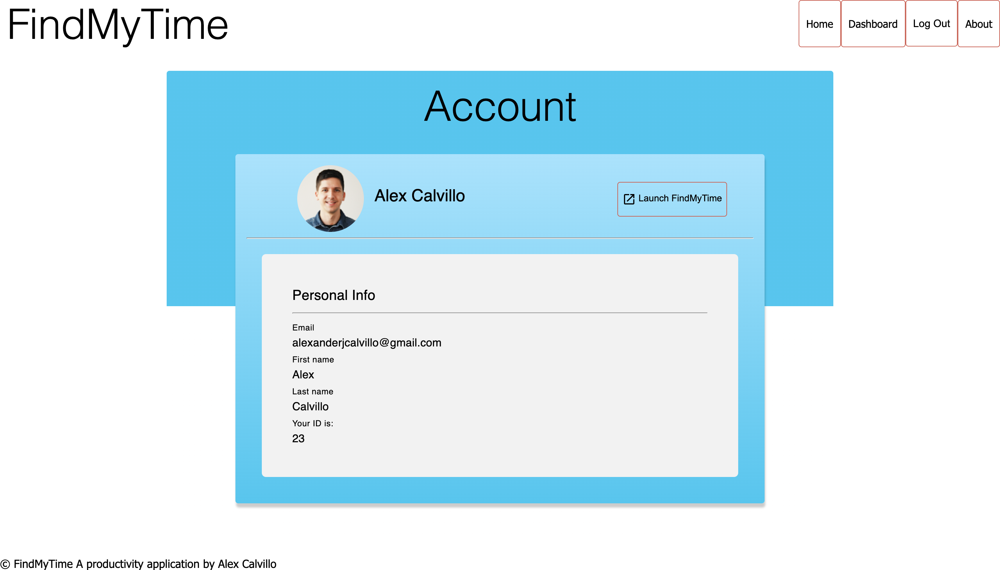
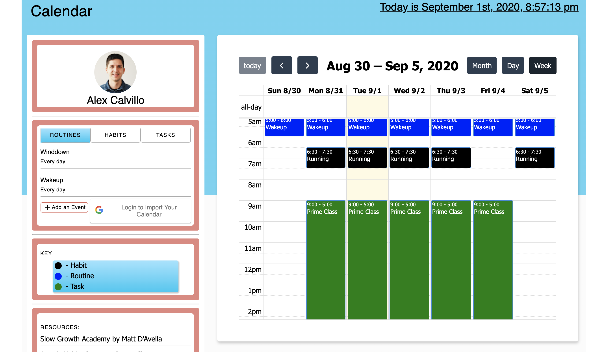

# FindMyTime Web Application

## Description

2 Week Sprint (WIP)

A tool to help you find the time in your schedule where you might normally say you are too "busy" to do something. The calendar application breaks down the way you think about scheduling your time between routines, tasks, and habits.

## Screen Shot

### Prerequisites

- [React.js](https://reactjs.org)
- [Node.js](https://nodejs.org/en/)
- [PostgreSQL](https://www.postgresql.org)
- [Moment.js](https://momentjs.com)
- [RRule](https://www.npmjs.com/package/rrule)
- [Full Calendar](https://fullcalendar.io)

## Installation

1. Create a database named `findmytime_app`,
2. The queries in the `database.sql` file are set up to create all the necessary tables and populate the needed data to allow the application to run correctly. The project is built on [Postgres](https://www.postgresql.org/download/), so you will need to make sure to have that installed. We recommend using Postico to run those queries as that was used to create the queries,
3. Open up your editor of choice and run an `npm install`
4. Run `npm run server` in your terminal
5. Run `npm run client` in your terminal
6. The `npm run client` command will open up a new browser tab for you!

## Usage

1. Open the client and register your account
2. Upon initial login you will be walked through a simple setup process.
3. Once completed, the profile page will allow you to launch the application.
4. On the dashboard you can view your schedule, see your weekly events, and add events to your schedule.

## Built With

- HTML
- CSS
- Material-UI
- JavaScript
- React
- Redux
- Redux-Saga
- Node.js
- Express
- Axios
- Google OAuth2.0
- Google Calendar API
- Full Calendar
- RRule Library

## Acknowledgement

Thanks to Myron, Scott, and Rachael for supporting me through this process of developing my first solo application. My Apis Cohort group for supporting me and listening to me gripe when things didn't work, and "hoorayed" with me when things did work! I learned a lot!
